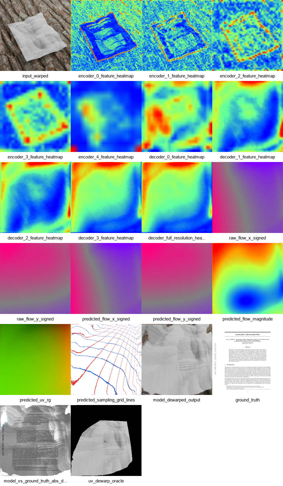
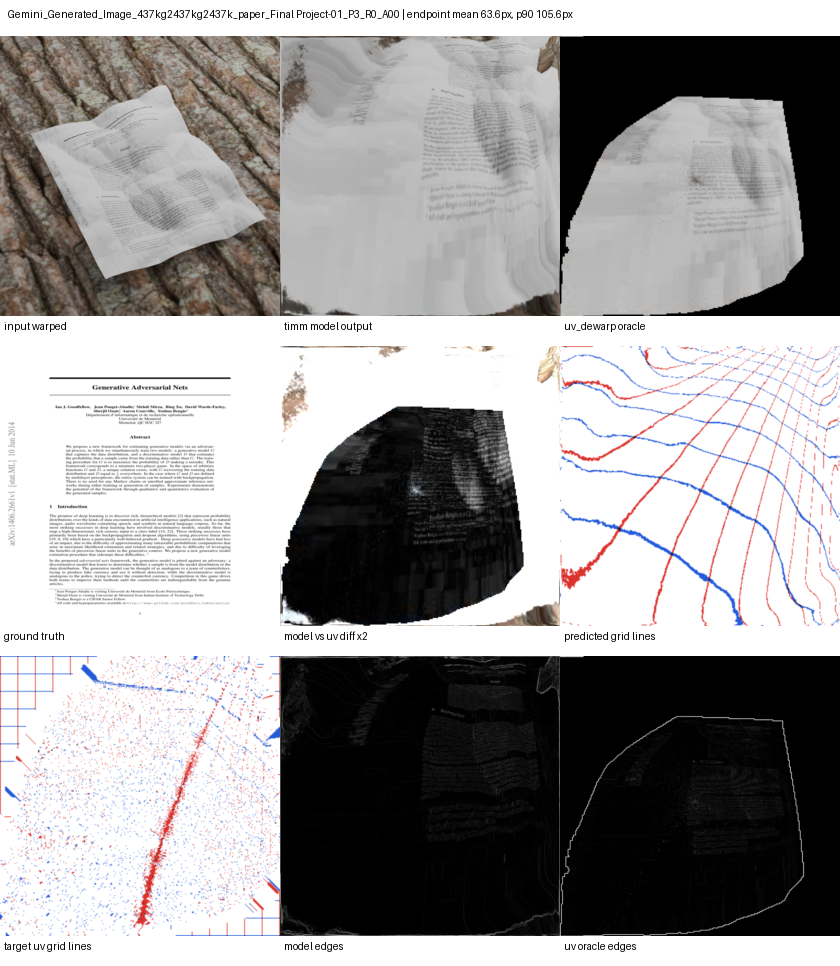
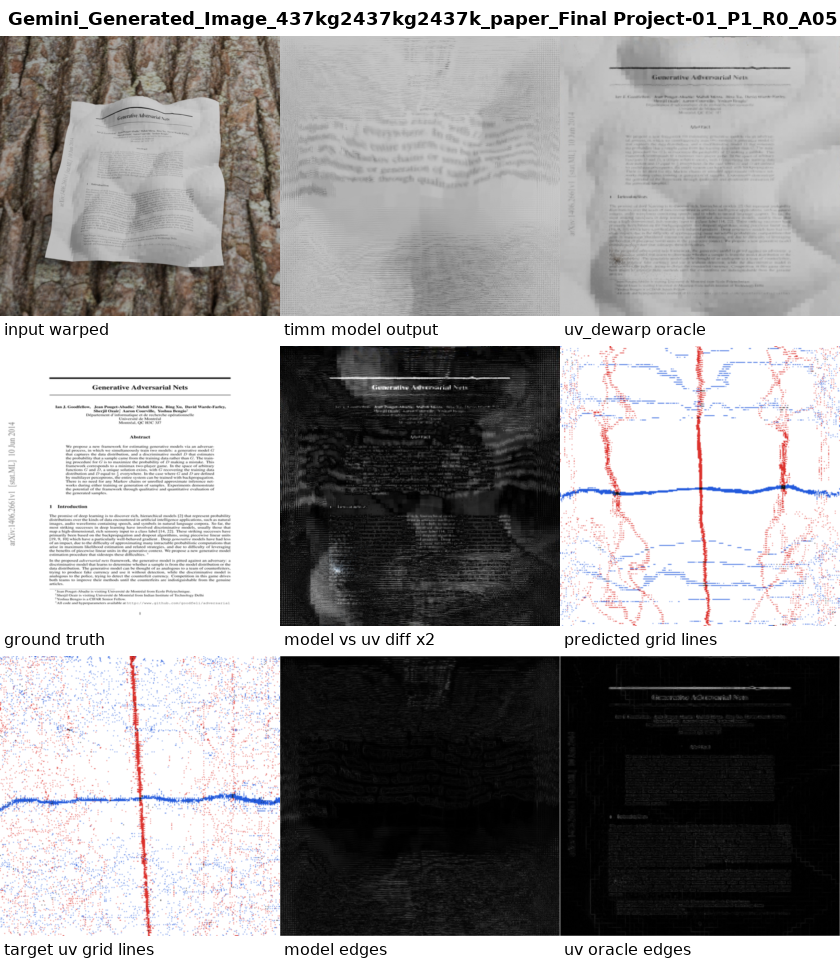

# ML Based Document Dewarper

Author: Phillip Roos

## Project Goal

This project builds a machine-learning based document dewarper for images of pages that are folded, crumpled, curved, or otherwise non-rigidly deformed. In this report I explore two model approaches, a simplified model and my attempt at building a more advanced model. Both models had strengths and weaknesses that the other model did not

The core idea is:

1. Load a warped document image.
2. Use a pretrained visual backbone to understand document shape and surface geometry.
3. Decode those features into a dense 2-channel flow or UV-like sampling grid.
4. Use `torch.nn.functional.grid_sample` to resample the original image into a flatter output.

The network therefore does not directly paint a new document. It predicts geometry, and the final image is created by differentiable warping.

## Dataset and Supervision

The dataset is stored under `renders/synthetic_data_pitch_sweep/` and separates appearance from geometry:

- `rgb/`: warped input images.
- `ground_truth/`: clean flat target documents.
- `uv/`: UV coordinate maps describing the paper surface geometry.
- `border/`: document masks used to distinguish paper from background.

## First Main Model: `timm_geometry_outputs_b3_384_geomstrong`

The first strong model version was trained in:

`timm_geometry_outputs_b3_384_geomstrong/best_timm_geometry.pth`

This model is the best balanced version for the project requirements. It follows the requested architecture closely while remaining relatively stable.

### Architecture

The model is implemented in `model_timm_geometry.py` as `TimmGeometryUnwrapper`.

The encoder uses a pretrained `timm` backbone:

- Backbone: `tf_efficientnet_b3_ns`
- Pretraining: enabled
- Input size: `384 x 384`
- Backbone mode: `features_only=True`
- Feature stages: five encoder feature maps from progressively lower resolutions

This satisfies the requirement to avoid training the visual encoder from scratch. EfficientNet supplies strong pretrained low-level and mid-level visual features, which helps the model recognize document boundaries, text regions, folds, and broad surface curvature.

The decoder is U-Net style:

- It starts from the deepest EfficientNet feature map.
- It upsamples stage by stage.
- It uses skip connections from earlier encoder features.
- Decoder channels follow the pattern `(256, 128, 64, 32)`.

The skip connections are important because dewarping needs both global surface understanding and local spatial detail. The deepest encoder layer provides global shape information, while earlier layers preserve sharper local cues like document edges and text bands.

The head is a final convolutional flow predictor:

- Input: decoded feature map plus explicit coordinate channels.
- Output: 2 channels.
- Channel 0: horizontal displacement / sampling coordinate component.
- Channel 1: vertical displacement / sampling coordinate component.

The head predicts a residual flow over an identity sampling grid:

```python
base_grid = create_base_grid(batch_size, height, width, device, dtype)
raw_flow = head(concat(decoded_features, coordinate_channels))
flow = tanh(raw_flow) * max_displacement
predicted_grid = base_grid + flow
```

The model uses `max_displacement = 2.0`, and the final grid is represented in the normalized `[-1, 1]` coordinate system expected by `grid_sample`.

### Differentiable Unwarping

The model output is passed directly into `torch.nn.functional.grid_sample`:

```python
dewarped = F.grid_sample(
    input_image,
    predicted_grid,
    mode="bilinear",
    padding_mode="border",
    align_corners=True,
)
```

This is the key design choice. The network predicts the geometric transformation, not the final texture. Since `grid_sample` is differentiable, training can backpropagate through the resampling step and update the encoder, decoder, and flow head.

### Geometry and UV Loss

The provided UV maps describe where each input pixel lies on the flat document. However, `grid_sample` needs the inverse relationship: for each output pixel, where should it sample from the input image? To train this model, the UV maps were converted into an inverse sampling grid. The training code scatters source pixel locations into UV space and fills holes, producing a target grid that can be compared directly against the predicted grid. Whether this was the best way to go about UV mapping, I'm not sure but this gives the model direct geometry supervision instead of relying only on image reconstruction.

The main geometric loss can be seen below:

```text
grid_loss = robust_l1(predicted_grid, target_inverse_grid)
```

For `timm_geometry_outputs_b3_384_geomstrong`, the most important loss weights were:

| Loss | Weight |
|---|---:|
| Grid / UV inverse-grid loss | `20.0` |
| Reconstruction loss | `0.05` |
| SSIM loss | `0.05` |
| Edge loss | `0.05` |
| Flow smoothness | `0.02` |

The learning rate was `1e-4` for the decoder and head, with the pretrained encoder trained more gently at `1e-5` through `encoder_lr_scale = 0.1`.

### SSIM and Masked Loss

SSIM was added because the target image and warped input do not share identical lighting. SSIM compares structural similarity rather than raw pixel values, making it more appropriate for document dewarping than MSE alone.

Masks from the dataset were also important. The model should spend its capacity on the paper surface, not on the background. The loss therefore focuses on valid document regions using the available document masks and UV foreground masks.

### Output Behavior

This model learned a meaningful geometric warp. It could often move the page into a more document-like rectangular layout and preserve some broad text organization. However, the output remained soft and sometimes locally distorted. The text was not consistently readable because the learned grid still lacked precise local alignment at the scale of text rows and words.

Final validation metrics for this model:

| Metric | Value |
|---|---:|
| Final validation loss | `0.3765` |
| Final validation grid loss | `0.0159` |
| Final validation SSIM score | `0.3731` |

In the image below, the debug panel shows the model pipeline: the warped input, encoder feature maps, decoder feature maps, predicted flow/UV grid, model dewarped output, ground truth, and UV-dewarp oracle.



The labeled comparison below focuses on the most important visual outputs: warped input, model rectification, UV-dewarp oracle, ground truth, grid lines, and edge alignment.



## Advanced Geometry Model: `timm_geometry_outputs_b3_textgeom_gridgrad`

The next major evolution was:

`timm_geometry_outputs_b3_textgeom_gridgrad/best_timm_geometry.pth`

This version was designed to emphasize geometric structure more strongly, especially the local shape of text rows and document edges. It is a more advanced model, but it was less stable and produced less predictable visual outputs.

### Architecture Changes

The backbone stayed the same:

- Backbone: `tf_efficientnet_b3_ns`
- Pretraining: enabled
- Input size: `384 x 384` (I tried experimenting with larger resolutions but they kept failing)
- Learning rate: `1e-4`
- Encoder learning rate scale: `0.1`

The decoder and prediction head were made more expressive:

| Component | `geomstrong` | `textgeom_gridgrad` |
|---|---:|---:|
| Decoder refinement blocks | `0` | `3` |
| Head channels | default/simple | `96` |
| Head depth | default/simple | `3` |
| Batch size | `4` | `16` |
| Epochs | `100` | `120` |

The purpose of the larger head and additional refinement blocks was to let the model predict more local geometric corrections. In theory, this should help with text rows, page folds, and small-scale deformations that a smoother baseline grid may miss.

### More Geometry-First Training

The loss function was changed to put much stronger emphasis on geometric supervision:

| Loss | Weight |
|---|---:|
| Grid / UV inverse-grid loss | `80.0` |
| Grid-gradient loss | `120.0` |
| Edge-weighted grid loss | `30.0` |
| Reconstruction loss | `0.01` |
| SSIM loss | `0.02` |
| Edge loss | `0.02` |
| Oracle reconstruction loss | `0.05` |
| Oracle SSIM loss | `0.20` |
| Oracle edge loss | `0.20` |
| Smoothness | `0.005` |
| Foldover penalty | `0.05` |
| Bending penalty | `0.002` |
| Mask sample loss | `0.5` |

The most important new term was grid-gradient loss. Instead of only asking the model to match absolute UV/sample locations, this term also asks the local derivatives of the predicted grid to match the local derivatives of the target grid:

```text
grid_gradient_loss =
    robust_l1(d(predicted_grid)/dx, d(target_grid)/dx)
  + robust_l1(d(predicted_grid)/dy, d(target_grid)/dy)
```

This was added because readable text depends heavily on local geometry. Even if the page is roughly in the correct location, text becomes unreadable when local grid spacing, curvature, or row direction is wrong.

The model also used edge-weighted grid loss. Edges from the UV oracle were used to increase the importance of geometrically meaningful regions, such as text strokes and document boundaries.

### Output Behavior

This model produced a more aggressively geometric solution. In numeric UV comparison, it had better inverse-grid alignment than later smoothed-gradient experiments:

| Metric from 3-sample UV comparison | Value |
|---|---:|
| Mean endpoint grid error | `11.93 px` |
| P90 endpoint grid error | `26.90 px` |
| P95 endpoint grid error | `36.45 px` |
| Model vs UV-dewarp SSIM | `0.1638` |
| Edge F1 vs UV-dewarp | `0.1515` |

However, the visual output was less stable. The model often introduced ripple-like artifacts and local warping that hurt word readability. This happened because the model was being pushed very hard to match noisy inverse-grid targets and local derivatives. The result was more advanced geometrically, but not necessarily more readable.

Final validation metrics:

| Metric | Value |
|---|---:|
| Best validation loss | `15.4611` |
| Final validation loss | `15.4737` |
| Best validation SSIM score | `0.3280` |
| Final validation SSIM score | `0.3260` |
| Final oracle SSIM score | `0.4159` |
| Final validation grid loss | `0.0412` |
| Final validation grid-gradient loss | `0.0888` |
| Final edge-grid loss | `0.0433` |

The much higher validation loss is not directly comparable to `geomstrong`, because the loss weights are much larger. Most of the total comes from the heavily weighted grid, grid-gradient, and edge-grid terms. This model should be interpreted as a more advanced geometry experiment, not as a simple worse validation-loss run.

The comparison panel below shows the tradeoff. The model captures stronger geometric structure, but the text is still not consistently readable and the dewarped result contains ripple artifacts.



The full debug panel below shows where the pipeline becomes unstable. Early encoder features still locate the document and folds, but the later decoder/head stages produce a sampling grid with local artifacts. The final `grid_sample` output then inherits those artifacts.


## Comparison and Lessons Learned

The two models represent different points in the design space.

| Model | Strength | Weakness | Final SSIM score |
|---|---|---|---:|
| `timm_geometry_outputs_b3_384_geomstrong` | Best balanced implementation of the required pipeline; stable training; clear pretrained encoder-decoder-flow design | Soft output and incomplete local text correction | `0.3731` |
| `timm_geometry_outputs_b3_textgeom_gridgrad` | More advanced geometry-first loss; stronger local grid supervision; better direct UV comparison on selected samples | Less stable, more ripple artifacts, less readable text | `0.3260` |

The `geomstrong` model is the better final project model if the goal is to demonstrate a clean implementation of the assignment requirements. It uses a pretrained `timm` backbone, U-Net-style decoder, 2-channel flow head, UV/grid supervision, SSIM, masking, and differentiable unwarping through `grid_sample`.

The `textgeom_gridgrad` model is the better research direction. It more directly targets the real failure mode: local text geometry. However, it likely needs more data, more training time, and cleaner inverse-grid targets. The provided UV maps are forward maps, while the neural network needs an inverse sampling grid. The current inverse-grid construction can contain holes and noisy local derivatives, which makes the grid-gradient model harder to train predictably.

## Future Improvements

The most important next improvement would be to precompute cleaner inverse sampling-grid targets from the UV maps. Instead of generating a noisy inverse grid inside every batch, a preprocessing step could create stable target grids with better splatting, interpolation, confidence masks, and hole filling. This would make direct grid supervision and grid-gradient supervision more reliable.

Other useful improvements include:

- Train with more synthetic samples and wider deformation diversity.
- Use multi-scale grid loss so the model learns both global page layout and local text-row corrections.
- Add a two-stage training schedule: first train only geometry, then fine-tune lightly with SSIM and oracle reconstruction.
- Improve mask quality so the model never samples background as document texture.
- Explore a transformer or Swin-style backbone for stronger long-range fold understanding.

Overall, the best current model for the project requirements is `timm_geometry_outputs_b3_384_geomstrong`, while `timm_geometry_outputs_b3_textgeom_gridgrad` is the most promising advanced version for future work.
